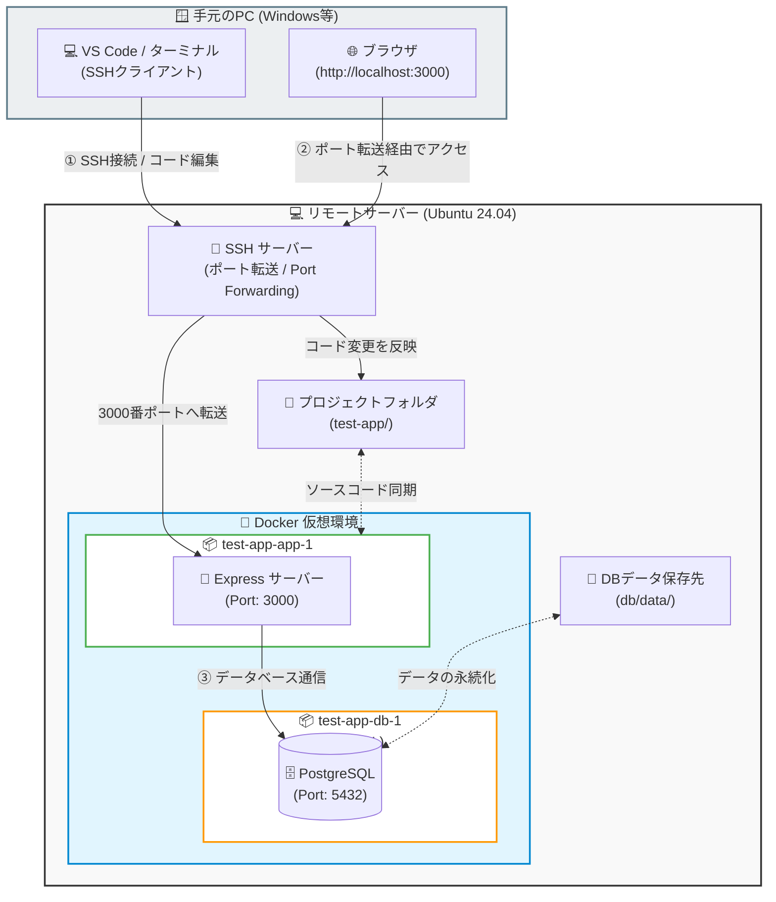

# Docker TODO App

Docker (Node.js + PostgreSQL) で動作する、シンプルなTODO管理アプリケーションです。
タスクの追加と、チェックボックスによる完了・未完了の状態更新が可能です。

## 🛠 技術スタック
- **Frontend**: HTML5, Vanilla JavaScript, CSS3
- **Backend**: Node.js (Express)
- **Database**: PostgreSQL 16

---

## 🚀 起動方法

Linux環境（Ubuntu等）では、Dockerコマンドの実行やデータの権限管理のために `sudo` が必要になる場合があります。

### 1. アプリケーションの起動
プロジェクトのルートディレクトリで以下のコマンドを実行します。

```bash
sudo docker compose up --build
```

起動後、ブラウザで http://localhost:3000 にアクセスするとアプリが利用できます。

## 📊 リモート開発・システム構成図

